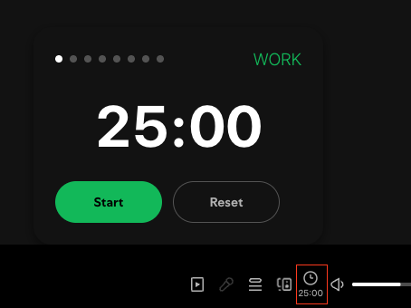

# Pomofy - Chrome Extension




**A free, open-source Pomodoro timer that integrates seamlessly into Spotify Web Player.**

## ⚠️ Disclaimer

**Pomofy is an unofficial browser extension and is not affiliated with, endorsed by, or connected to Spotify AB.** This extension is provided "as is" for productivity purposes and does not modify Spotify's core functionality. Spotify is a trademark of Spotify AB.

## Features

### Core Timer Functionality

- **Customizable Pomodoro cycles** with flexible work/break durations
- **Multiple presets**: Classic (25/5/15), Deep Focus (50/10/30), Quick Sprint (15/3/10), or Custom
- **Configurable cycle length** (2-8 work sessions per cycle)
- **Auto-continue sessions** or manual progression
- **Smart reset system** (single click = current session, double click = full cycle)

### Spotify Integration

- **Seamlessly integrated** into Spotify's player bar controls
- **Non-intrusive design** that matches Spotify's dark theme
- **No interference** with music playback or Spotify features
- **Quick access** - timer button appears next to volume controls

### Visual Indicators

- **Dynamic favicon** changes color based on timer state:
  - 🟢 Green: Work session running
  - 🔵 Blue: Break session running
  - 🔴 Red: Session/cycle complete
  - ⚫ Grey: Timer stopped or paused
- **Live tab title** shows countdown timer for at-a-glance progress
- **Progress dots** in popup show your position in the current cycle
- **Monitor from any tab** - no need to keep Spotify open

### 🔧 Customization

- **Timer durations**: Set custom work, short break, and long break lengths
- **Audio notifications**: Choose from different completion sounds with volume control
- **UI preferences**: Toggle tab title updates and auto-continue behavior
- **Persistent settings** saved across browser sessions

## Installation

### Method 1: Chrome Web Store (Coming Soon)

_Extension will be available on the Chrome Web Store once published_

### Method 2: Manual Installation (Developer Mode)

1. **Download** or clone this repository:
   ```bash
   git clone https://github.com/yourusername/pomofy-extension.git
   ```
2. **Open Chrome Extensions page**:
   - Go to `chrome://extensions/`
   - Or click Menu → More Tools → Extensions
3. **Enable Developer Mode** (toggle in top-right corner)
4. **Load the extension**:
   - Click "Load unpacked"
   - Select the extension folder you downloaded
5. **Visit Spotify**: Go to [open.spotify.com](https://open.spotify.com)
6. **Find the timer**: Look for the timer icon next to volume controls

## Usage

### First Time Setup

1. **Visit Spotify Web Player** - the interactive tutorial will start automatically
2. **Follow the tutorial** to learn about timer placement and features
3. **Customize settings** by clicking the extension icon in your browser toolbar

### Daily Use

1. **Start a session**: Click the timer button in Spotify's player bar
2. **Begin timer**: Click "Start" in the popup to begin your work session
3. **Track progress**: Watch the progress dots and timer countdown
4. **Session transitions**:
   - Timer will alert you when sessions complete
   - Choose to continue manually or enable auto-continue
5. **Monitor anywhere**: Tab title and favicon show status from any browser tab

### Customization

1. **Open settings**: Right-click the extension icon → "Options" or click the extension icon
2. **Choose preset**: Select Classic, Deep Focus, Quick Sprint, or Custom
3. **Adjust durations**: Set work, break, and long break times (in minutes)
4. **Configure cycle**: Choose 2-8 work sessions per cycle
5. **Audio settings**: Select notification sound and volume level
6. **UI preferences**: Toggle tab title updates and auto-continue

## Privacy & Security

- **No data collection** - extension doesn't track or store personal information
- **Local storage only** - all settings saved in your browser
- **No external connections** - doesn't communicate with external servers
- **No Spotify API usage** - doesn't access your Spotify account data
- **Minimal permissions** - only requests storage permission for settings

## Contributing

This is an open-source project! Contributions are welcome:

1. **Fork the repository**
2. **Create a feature branch**: `git checkout -b feature-name`
3. **Make your changes** and test thoroughly
4. **Submit a pull request** with a clear description

## Credits

- **Implementation inspiration**: [@rnikkos's Spotify Extension](https://github.com/rnikko/spotify-playback-speed)
- **Audio**: [Gong sound](https://freesound.org/people/juskiddink/sounds/86773/) by juskiddink (CC Attribution 4.0)

## 📄 License

This project is licensed under the MIT License - see the [LICENSE](LICENSE) file for details.

_Made with ❤️ for productivity enthusiasts who love Spotify_
