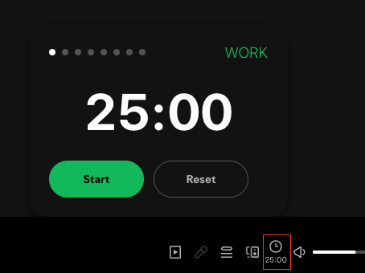

# Pomofy - Chrome Extension

A Pomodoro timer Chrome extension that integrates seamlessly into Spotify Web Player.

## Features

- 8-session Pomodoro cycle (Four 25 minute work sessions, three 5 minute breaks, one 15 minute long break)
- **Integrated into Spotify's playbar controls**
- **Visual tab indicators** - favicon and title show timer status without switching tabs
- Manual progression between sessions
- Visual progress dots showing cycle status
- Smart reset (single click = current session, double click = full cycle)
- Session completion audio notifications
- Clean Spotify-themed dark UI

## Visual Tab Indicators

- **Dynamic favicon** that changes color based on timer state:
  - 🟢 Green: Work session running
  - 🔵 Blue: Break session running  
  - 🔴 Red: Session/cycle complete
  - ⚫ Grey: Timer stopped or paused
- **Live tab title** shows countdown timer for at-a-glance progress
- **No need to switch tabs** - monitor your Pomodoro progress from any browser tab

## Installation

1. Download or clone this repository
2. Open Chrome → Extensions (`chrome://extensions/`)
3. Enable "Developer Mode"
4. Click "Load Unpacked" and select the extension folder
5. Visit [Spotify Web Player](https://open.spotify.com)
6. Look for the timer icon next to the volume controls

## Usage

1. Click the timer icon in Spotify's playbar
2. Click "Start" to begin the first work session
3. When timer reaches 00:00, it shows the next session time
4. Click "Start" again to begin the next session
5. Progress dots show your position in the cycle

## Credits

Implementation was inspired by @rnikkos's [Spotify Extension](https://github.com/rnikko/spotify-playback-speed?tab=readme-ov-file).

### Audio

- [Gong.mp3](https://freesound.org/people/juskiddink/sounds/86773/): juskiddink - Licensed under CC Attribution 4.0
